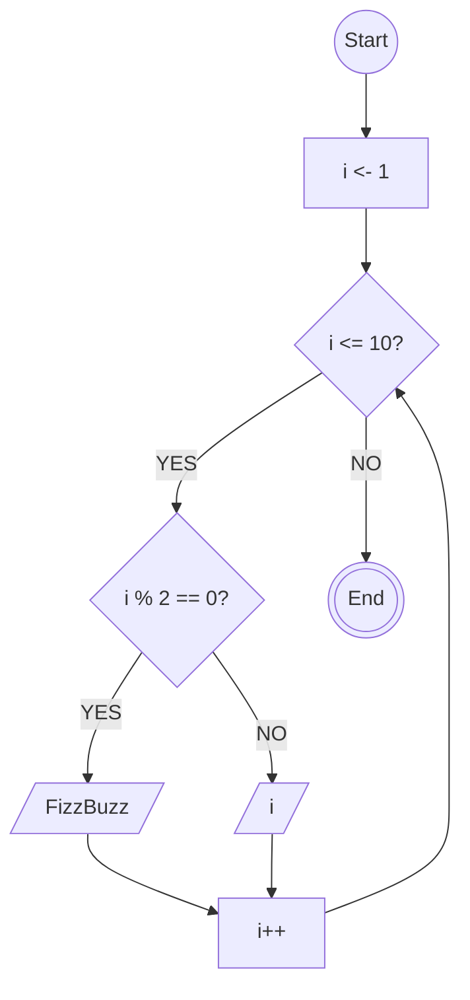

# Algoritma FizzBuzz

## Flowchart

```mermaid
flowchart TD
  start((Start))
  init[i <- 1]
  loop{i <= 10?}
  check{i % 2 == 0?}
  true[/FizzBuzz/]
  false[/i/]
  inc[i++]
  finish(((End)))

  start --> init
  init --> loop
  loop -- YES --> check
  check -- YES --> true
  true --> inc
  check -- NO --> false
  false --> inc
  inc --> loop
  loop -- NO --> finish
```

## PseudoCode
```pseudocode
FOR i <- i TO 10 STEP 1
  IF i % 2 = 0 THEN
    OUTPUT "FizzBuzz"
  ELSE
    OUTPUT i
  ENDIF
NEXT i
```